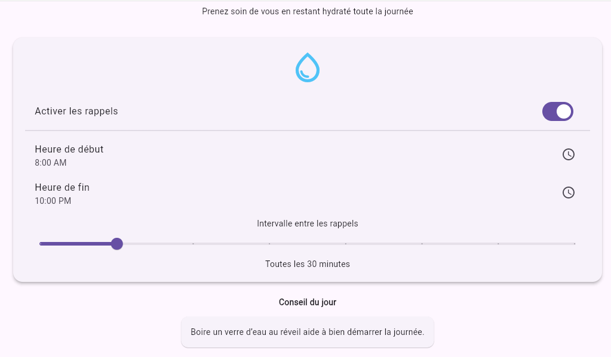

# hydratation

## Description
Application mobile simple qui envoie des notifications pour rappeler à l’utilisateur de boire de l’eau à intervalle régulier.  
Ce projet est le **huitième** du défi personnel **100 projets en 2026**.

---

## Objectifs du projet
- Planifier des notifications locales
- Sauvegarder les préférences utilisateur
- Gérer l’état et l’interface en temps réel
- Offrir une expérience mobile simple et agréable

---

## Plateforme
- Mobile 

---

## Technologies utilisées
- Flutter
- Dart
- `flutter_local_notifications` pour les notifications
- `shared_preferences` pour sauvegarder les réglages

---

## Fonctionnalités
- Choisir l’intervalle de rappel (ex: 30, 60, 90 minutes)
- Activer / désactiver les notifications
- Notification locale : “Pense à boire de l’eau 💧”
- Sauvegarde automatique de la préférence
- Interface simple et intuitive

---

## Design & UX
- Interface minimaliste et apaisante
- Palette fraîche inspirée de l’eau
- Contrôles clairs et lisibles
- Expérience mobile fluide et accessible

---

## Captures d’écran

---

## Ce que j’ai appris
- Notifications locales en Flutter
- Sauvegarde de préférences utilisateur
- Gestion du temps et des intervalles
- Création d’une UI simple et agréable

---

## Améliorations possibles
- Suivi de consommation d’eau quotidienne
- Historique et statistiques
- Alertes personnalisables
- Animations pour rendre le rappel plus engageant

---

## Statut du projet
 **Projet terminé**
